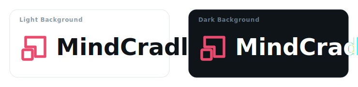

<p align="center">
  
</p>

# MindCradle — Mental Health & Well-being Dashboard

**MindCradle** is a modern, premium, and calming mental health dashboard designed to help users track their emotional well-being, establish mindful habits, and reflect on their days with a gentle, non-clinical AI companion named ARIA.

---

## Key Features

* <svg width="16" height="16" viewBox="0 0 24 24" fill="none" stroke="currentColor" stroke-width="2" stroke-linecap="round" stroke-linejoin="round" style="vertical-align: middle; margin-right: 4px; display: inline-block;"><path d="M12 20h9"/><path d="M16.5 3.5a2.12 2.12 0 0 1 3 3L7 19l-4 1 1-4Z"/></svg> **Guided Journaling**: Document your thoughts in response to daily prompts with an integrated ambient layer (play calming audio like Rain on Glass, Forest Morning, or Ocean Waves while writing).
* <svg width="16" height="16" viewBox="0 0 24 24" fill="none" stroke="currentColor" stroke-width="2" stroke-linecap="round" stroke-linejoin="round" style="vertical-align: middle; margin-right: 4px; display: inline-block;"><path d="m12 3-1.912 5.813a2 2 0 0 1-1.275 1.275L3 12l5.813 1.912a2 2 0 0 1 1.275 1.275L12 21l1.912-5.813a2 2 0 0 1 1.275-1.275L21 12l-5.813-1.912a2 2 0 0 1-1.275-1.275Z"/><path d="m5 3 1 2.5L8.5 6 6 7 5 9.5 4 7 1.5 6 4 5Z"/><path d="m19 17 1 2.5 2.5.5-2.5 1-1 2.5-1-2.5-2.5-1 2.5-1Z"/></svg> **ARIA (AI Companion)**: A validating companion powered by OpenRouter (`google/gemma-4-31b-it:free`). ARIA notices themes, offers gentle reflections, and recommends resources without diagnosing or prescribing.
* <svg width="16" height="16" viewBox="0 0 24 24" fill="none" stroke="currentColor" stroke-width="2" stroke-linecap="round" stroke-linejoin="round" style="vertical-align: middle; margin-right: 4px; display: inline-block;"><rect x="16" y="16" width="6" height="6" rx="1"/><rect x="2" y="16" width="6" height="6" rx="1"/><rect x="9" y="2" width="6" height="6" rx="1"/><path d="M12 8v8"/><path d="M12 16H5"/><path d="M12 16h7"/></svg> **Compounding Intelligence Engine (CIE)**: A Personal Knowledge Graph (PKG) dynamically constructed from your daily logs. It categorizes goals, coping behaviors, and stressors, detects life chapters (e.g., *Finding My Rhythm*), and displays cross-chapter growth comparisons.
* <svg width="16" height="16" viewBox="0 0 24 24" fill="none" stroke="currentColor" stroke-width="2" stroke-linecap="round" stroke-linejoin="round" style="vertical-align: middle; margin-right: 4px; display: inline-block;"><circle cx="11" cy="11" r="8"/><path d="m21 21-4.3-4.3"/></svg> **Hybrid Semantic Search**: Search all your historical logs (mood, journal, rituals, ARIA check-ins) using a pgvector-based hybrid semantic and keyword search. Includes dynamic query suggestions (e.g., *When was I happiest?*).
* <svg width="16" height="16" viewBox="0 0 24 24" fill="none" stroke="currentColor" stroke-width="2" stroke-linecap="round" stroke-linejoin="round" style="vertical-align: middle; margin-right: 4px; display: inline-block;"><path d="M22 12h-4l-3 9L9 3l-3 9H2"/></svg> **Mood Logging & Calm Score**: Record daily mood levels (1-10) and specific emotions. Observe emotional trends with check-in streaks and a dynamic weekly **Calm Score** (out of 100).
* <svg width="16" height="16" viewBox="0 0 24 24" fill="none" stroke="currentColor" stroke-width="2" stroke-linecap="round" stroke-linejoin="round" style="vertical-align: middle; margin-right: 4px; display: inline-block;"><circle cx="12" cy="12" r="4"/><path d="M12 2v2"/><path d="M12 20v2"/><path d="m4.93 4.93 1.41 1.41"/><path d="m17.66 17.66 1.41 1.41"/><path d="M2 12h2"/><path d="M20 12h2"/><path d="m6.34 17.66-1.41 1.41"/><path d="m19.07 4.93-1.41 1.41"/></svg> **Morning Rituals**: Prepare for your day by forecasting your mood, setting daily intentions, and completing small breathing or stretching activities.
* <svg width="16" height="16" viewBox="0 0 24 24" fill="none" stroke="currentColor" stroke-width="2" stroke-linecap="round" stroke-linejoin="round" style="vertical-align: middle; margin-right: 4px; display: inline-block;"><path d="M12 3a6 6 0 0 0 9 9 9 9 0 1 1-9-9Z"/></svg> **Evening Wind Down**: Release stress by writing down items to let go of, listing things you are grateful for, selecting a wind-down audio track, and setting a relaxation timer.
* <svg width="16" height="16" viewBox="0 0 24 24" fill="none" stroke="currentColor" stroke-width="2" stroke-linecap="round" stroke-linejoin="round" style="vertical-align: middle; margin-right: 4px; display: inline-block;"><path d="M6 9H4.5a2.5 2.5 0 0 1 0-5H6"/><path d="M18 9h1.5a2.5 2.5 0 0 0 0-5H18"/><path d="M4 22h16"/><path d="M10 14.66V17c0 .55-.45 1-1 1H4v2h16v-2h-5c-.55 0-1-.45-1-1v-2.34"/><path d="M12 2a5 5 0 0 0-5 5v3c0 2.2 1.8 4 4 4h2c2.2 0 4-1.8 4-4V7a5 5 0 0 0-5-5z"/></svg> **Habit Milestones**: Unlock milestones (e.g., *First Light*, *7-Day Grounded*) to celebrate consistent self-care routines.
* <svg width="16" height="16" viewBox="0 0 24 24" fill="none" stroke="currentColor" stroke-width="2" stroke-linecap="round" stroke-linejoin="round" style="vertical-align: middle; margin-right: 4px; display: inline-block;"><path d="m19 21-7-4-7 4V5a2 2 0 0 1 2-2h10a2 2 0 0 1 2 2v16z"/></svg> **Curated Resources**: Access mental health tools categorized by crisis support, mindfulness, therapy, self-care, physical health, and creative outlets.

---

## <svg width="20" height="20" viewBox="0 0 24 24" fill="none" stroke="currentColor" stroke-width="2.2" stroke-linecap="round" stroke-linejoin="round" style="vertical-align: middle; margin-right: 6px; display: inline-block;"><rect width="16" height="16" x="4" y="4" rx="2"/><rect width="6" height="6" x="9" y="9" rx="1"/><path d="M9 1v3"/><path d="M15 1v3"/><path d="M9 20v3"/><path d="M15 20v3"/><path d="M20 9h3"/><path d="M20 15h3"/><path d="M1 9h3"/><path d="M1 15h3"/></svg> Tech Stack

### Frontend

* **Core**: React (TypeScript) + Vite + Framer Motion
* **Styling**: Modern CSS (featuring responsive layouts, dark glassmorphic aesthetics, and smooth animations)
* **Routing**: React Router

### Backend

* **Core**: Python + FastAPI + Uvicorn
* **Database**: Supabase (PostgreSQL) with `pgvector` extension
* **Database Client**: Supabase-py + PostgREST (stateless JWT handling)
* **AI Integration**: OpenRouter API (OpenAI client wrapper) + OpenAI Text Embedding API

---

## <svg width="20" height="20" viewBox="0 0 24 24" fill="none" stroke="currentColor" stroke-width="2.2" stroke-linecap="round" stroke-linejoin="round" style="vertical-align: middle; margin-right: 6px; display: inline-block;"><path d="M14.7 6.3a1 1 0 0 0 0 1.4l1.6 1.6a1 1 0 0 0 1.4 0l3.77-3.77a6 6 0 0 1-7.94 7.94l-6.91 6.91a2.12 2.12 0 0 1-3-3l6.91-6.91a6 6 0 0 1 7.94-7.94l-3.76 3.76z"/></svg> Setup & Installation

For a full breakdown of the application architecture, database schemas, and endpoints, please refer to the [Project Brain](project%20details/BRAIN.md).

### 1. Database Setup (Supabase)

1. Create a new project on [Supabase](https://supabase.com).
2. Go to the **SQL Editor** in the Supabase Dashboard.
3. Paste and run the SQL migration scripts in order from `backend/supabase/migrations/` starting with `001_initial_schema.sql` up to the latest migration (e.g., enabling pgvector and the PKG database tables).

### 2. Backend Setup

1. Navigate to the backend directory:

   ```bash
   cd backend
   ```

2. Create and activate a virtual environment:

   ```bash
   python -m venv .venv
   # On Windows:
   .venv\Scripts\activate
   # On macOS/Linux:
   source .venv/bin/activate
   ```

3. Install dependencies:

   ```bash
   pip install -e .
   ```

4. Copy the environment template and fill in your credentials in `.env`:

   ```bash
   cp .env.example .env
   ```

   * *Required Env Variables:* `SUPABASE_URL`, `SUPABASE_ANON_KEY`, `SUPABASE_JWT_SECRET`, `OPENROUTER_API_KEY`, `OPENROUTER_MODEL`
5. Run the server:

   ```bash
   uvicorn app.main:app --reload
   ```

### 3. Frontend Setup

1. Navigate to the frontend directory:

   ```bash
   cd ../frontend
   ```

2. Install npm packages:

   ```bash
   npm install
   ```

3. Start the dev server (Vite proxies api calls to the FastAPI server running on `http://localhost:8000`):

   ```bash
   npm run dev
   ```

---

## <svg width="20" height="20" viewBox="0 0 24 24" fill="none" stroke="currentColor" stroke-width="2.2" stroke-linecap="round" stroke-linejoin="round" style="vertical-align: middle; margin-right: 6px; display: inline-block;"><path d="m6 14 1.45-2.9A2 2 0 0 1 9.24 10H20a2 2 0 0 1 1.94 2.5l-1.55 6a2 2 0 0 1-1.94 1.5H4a2 2 0 0 1-2-2V5c0-1.1.9-2 2-2h3.93a2 2 0 0 1 1.66.9l.82 1.2a2 2 0 0 0 1.66.9H18a2 2 0 0 1 2 2v2"/></svg> Repository Structure

```text
├── backend/
│   ├── app/
│   │   ├── models/        # Pydantic validation schemas
│   │   ├── routers/       # API endpoints (auth, ai, journal, mood, rituals)
│   │   ├── services/      # Supabase, Embeddings, PKG & OpenRouter AI connectors
│   │   ├── config.py      # App configurations & settings
│   │   └── main.py        # FastAPI entrypoint & middleware
│   ├── supabase/          # Database SQL migration scripts (001 to 024)
│   ├── .env               # Private environment configurations
│   └── pyproject.toml     # Backend dependencies list
│
├── frontend/
│   ├── src/
│   │   ├── app/pages/     # React pages (Dashboard, ARIA, Journal, Rituals, Login, Understanding)
│   │   ├── components/    # Common UI widgets (SemanticSearch, AriaTerminalCard, GuestGate)
│   │   ├── lib/           # Fetch API wrappers and auth context providers
│   │   ├── styles/        # Global typography, color variables & themes
│   │   └── main.tsx       # Vite render entrypoint
│   └── vite.config.ts     # Dev proxy and asset resolvers
```
