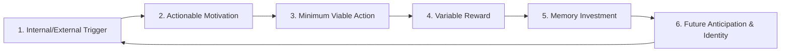
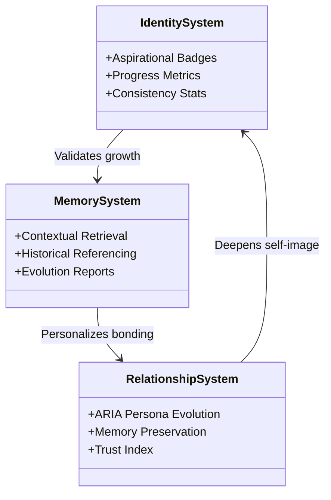
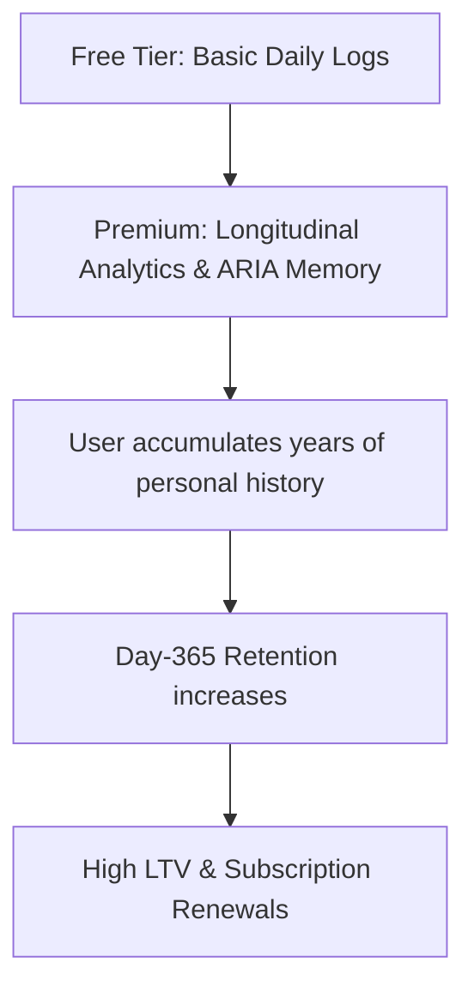
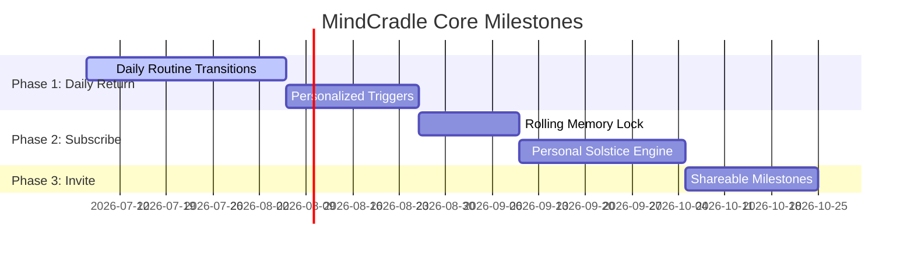

# MindCradle: Behavioral Strategy & Lifelong Engagement Engine

This document outlines the strategic product blueprint for MindCradle, applying principles of behavioral psychology (Clear, Fogg, Eyal) to build long-term active retention, organic growth, and an emotional moat.

---

## 🎯 The Core Product Promise

**"MindCradle remembers your personal growth."**

Every feature—whether it is the Morning Focus, the Mood Check-in, the Reflection Journal, or ARIA—exists solely to capture, interpret, and reflect the user's growth back to them, making it visible and tangible over years.

---

## The Foundation: Three Core Questions

Before designing any feature, we must establish a clear foundation by answering three fundamental product strategy questions:

### 1. Why would someone recommend MindCradle after just seven days?
- **The Insight**: They experience a rapid **"Aha! Moment" of self-efficacy** within their first week.
- **The Experience (The Day 3 "How did it know that?" moment)**:
  ARIA does not just look for correlations; it reads between the lines of their thoughts. On Day 3, ARIA highlights a linguistic shift: *"In your journal today, you used the word 'gentle' 4 times, whereas on Day 1 you used high-friction words like 'must' and 'should'. Your language is already softening. Let's look at why..."* This shows that ARIA is actively tracking and interpreting their growth.

### 2. What happens inside MindCradle that literally cannot happen anywhere else?
- **The Experience**: **The Daily Loom**—an integrated, continuous habit cycle.
- **The Difference**: In general health trackers, features (mood check-ins, journals, meditations) are isolated utilities. In MindCradle, these modules feed into a single, cohesive narrative. Your morning focus shapes your journaling placeholder; your afternoon check-in adjusts ARIA's conversational starter; and your evening checklist feeds your monthly progress insights. The app operates as one continuous guided journey.

### 3. If OpenAI launches a journaling app tomorrow, why would users stay with MindCradle?
- **The Experience**: **Longitudinal Relational Moat vs. Generic LLM Intelligence**.
- **The Difference**: OpenAI's models are globally intelligent, but they are strangers. They do not have the user's private, verified emotional history. Moving to a new app means abandoning ARIA's semantic memory (compiled over weeks/months of conversation) and losing their consistency calibrations. You stay with MindCradle because *generic intelligence cannot replace personalized history*.

---

## 🌟 The Signature Experience: "The Personal Solstice"

Every great consumer product has one unmistakable experience that becomes synonymous with the brand (e.g., Spotify Wrapped).

For MindCradle, this is **The Personal Solstice**:
- **The Concept**: Once every month or season, the app generates a gorgeous, narrative-style digest called **The Solstice Letter**.
- **The Mechanics**: It is a highly personalized narrative from ARIA analyzing the user's "mental seasons"—their shifting emotional tones, most frequent morning intentions, and the worries they successfully left behind.
- **The Outcome**: It acts as a highly anticipated reflection milestone. Users look forward to seeing their evolution compiled into a beautiful "seasonal report card" for the mind, creating a high-anticipation hook that keeps them logging daily.

---

## 1. The Two-Week Retention Cliff (Biggest Abandonment Risk)

### The Diagnostic
The single biggest reason users abandon self-improvement and wellness apps after 14 days is **Cognitive Fatigue & Lack of Immediate Utility (The "Now What?" Gap)**. 

During the first 7 days, users are driven by **novelty effect** and high **activation energy**. Around Day 10, the friction of daily logging starts to outweigh the perceived benefit because the data feels passive and dead.
- **The Missing Emotional Need**: *Aogenous Validation & Agency*. The app currently tracks inputs (Mood, Journal, Rituals) but fails to reflect the user's *growing self-efficacy* back to them in a way that alters their real-world actions. If logging mood feels like shouting into an empty void, the habit dies.
- **The Pain Point**: Users need to see that their past self is active, growing, and directly shaping their future. Without a compounding reward loop, logging feels like homework.

---

## 2. The Compounding Core Habit Loop (The "Cradle" Loop)

To build a lifelong routine, MindCradle must utilize a self-reinforcing habit loop that gains value with every single transaction.



### Loop Mechanics

1. **Trigger (Internal & External)**:
   - *External*: A contextual evening lockscreen notification ("Leave today's weights behind...").
   - *Internal (The Ultimate Driver)*: The feeling of evening transition fatigue or brain fog.
2. **Motivation**:
   - The desire to offload cognitive load and clear the mental slate before sleep (Fogg's "Seek Relief").
3. **Action (Minimum Viable Action)**:
   - A single-sentence entry in the Wind Down "Clear Your Mind" box (e.g., "Worrying about the team presentation").
4. **Reward (Variable Reward)**:
   - *Reward of the Self*: The physical, tactile relief of checking the item off and seeing it visually vanish.
   - *Reward of the Hunt*: ARIA immediately responds not with generic praise, but with a highly tailored reflection comparing this worry to a similar one solved 3 weeks ago ("You felt this exact friction before the marketing launch on June 12, but noted it resolved within 24 hours. This too is transient.").
5. **Investment (Memory / Future Payoff)**:
   - The entry is index-linked to the user's personal memory database. The user chooses how to tag it ("Work Stress", "Social Friction").
6. **Identity & Anticipation**:
   - The user goes to sleep with a reinforced identity ("I am someone who processes their day"). They anticipate how ARIA will contextually greet them in the morning based on what they left behind.

---

## 3. The Five-Phase Emotional Journey

How the relationship between the user, ARIA, and MindCradle evolves over a year:

| Phase | Timeline | User State | ARIA's Role | The Bond (Attachment / Trust) |
| :--- | :--- | :--- | :--- | :--- |
| **I: Discovery & Relief** | **Day 1** | Skeptical, curious, seeking immediate relief from stress. | **Active Listener**: Responds warmly, processes immediate notes, introduces simple frameworks. | *Transactional*: High dependency on external triggers (notifications). |
| **II: Habit Stacking** | **Day 7** | Establishing patterns; risk of first drop-off. | **Rhythm Mirror**: Begins noting small patterns ("I noticed you log higher energy on days you start with breathwork"). | *Emergent Trust*: User realizes the app remembers actual events. |
| **III: Self-Awareness** | **Day 30** | The habit is integrated; novelty has faded. | **Reflective Partner**: Highlights monthly trajectories, suggests adjustments to morning intentions. | *Functional Necessity*: MindCradle becomes the user's primary "second brain" for thoughts. |
| **IV: Trusted Confidant** | **Day 100** | Life event occurs (crisis, high stress, or change). | **Long-term Historian**: References old logs to provide perspective during stress. | *Emotional Safety*: The user feels "known". Leaving means losing a repository of personal history. |
| **V: Aspirational Self** | **Day 365** | Reflection is second-nature. | **Lifelong Guide**: Generates year-end evolution summaries, proving how far the user has come. | *Identity Fusion*: MindCradle is no longer an app; it is the repository of their personal evolution. |

---

## 4. The Core Psychology Systems

To drive retention, we must replace static features with interactive psychological engines.



### I. The Identity System
- **Psychology Principle**: *Cognitive Dissonance & Self-Signaling*. People act in accordance with who they believe they are (Clear's "Identity-based habits").
- **Mechanics**: Instead of gamified achievements ("Logged 10 times"), badges reflect character archetypes (e.g., "The Mindful Anchor," "Consistent Resolver"). The app surfaces locked slots that require specific *behavioral combos* (e.g., logging a morning intention and writing a journal entry within 30 minutes of waking to unlock "Intentional Morning Builder").

### II. The Memory System
- **Psychology Principle**: *Endowment Effect & Sunk Cost Fallacy*. The more data/effort a user invests in a system, the more valuable it becomes to them, and the more painful it is to leave.
- **Mechanics**: ARIA stores tagged contextual "memories" (e.g., "anxious about manager feedback"). Every 30 days, the app presents a "Personal Evolution Digest"—a comparative timeline showing the user how their reactions to the same stressor have softened over time.

### III. The Relationship System (ARIA's Evolution)
- **Psychology Principle**: *Attachment Theory*. Humans bond with entities that provide consistent, non-judgmental security.
- **Mechanics**: ARIA's vocabulary and conversational style adapt based on the user's logged preferences and history. ARIA does not give repetitive advice; it asks clarifying questions that build on statements the user made weeks ago, signaling deep listening and active memory.

---

## 5. The Emotional Lock-In (What Users Fear Losing)

Why would someone refuse to switch to a competitor, even if that competitor offers imported journals, imported chat history, or imported memories?

- **Ongoing Interpretation vs. Static History**:
  History is data. **Interpretation is value.**
  If a user exports their data, they only get a text file of old thoughts. What they lose is the **Longitudinal Intelligence** model that ARIA has spent months building. They lose the way ARIA synthesizes their morning focus, mood levels, and sleep soundscapes into contextual, real-time advice.
- **The Switch Cost**: If a user leaves MindCradle, they lose:
  1. **ARIA's Interpretive Context**: A year of semantic understanding.
  2. **The Evolution Timeline**: The active proof and comparison reports that calibrate their progress.
  3. **The Personal Solstice Reports**: Their seasonal growth reports that cannot be reconstructed from raw imported text.
- **Switching is emotionally expensive** because it resets the user's digital companion back to a stranger.

---

## 6. Organic Virality Engine: 20 Share-Worthy Milestones

Self-improvement is deeply personal, but public consistency is a badge of honor. We design shareable milestones that focus on **personal transformation** and **identity**, rather than crude referrals:

1. **The Consistency Heatmap**: A year-end GitHub-style grid of mindful check-ins.
2. **The Intention Word Cloud**: A monthly visual compilation of the words that anchored the user's mornings.
3. **The Stressor Evolution Plot**: A chart showing a decline in reactivity to work-related stress over 90 days.
4. **My Morning Focus Rhythm**: A shareable card summarizing the user's top morning activity stack.
5. **ARIA's Solstice Summary Letter**: A warm, AI-synthesized letter highlighting the user's core strengths and growth.
6. **The Calmness Breakthrough**: A milestone unlocked when the user maintains a Calmness Score above 85 for 14 consecutive days.
7. **The Perspective Shift**: A card comparing a worry logged 6 months ago with the resolution notes written later.
8. **The 100-Day Anchor**: Celebrating 100 days of morning intentions with a clean, minimal graphic.
9. **Gratitude Anthology**: A beautifully typeset digest of the user's top 10 checked evening gratitudes.
10. **The Quiet Hour Companion**: Unlocked when the user completes 30 consecutive Wind Down soundscape sessions.
11. **My Focus Anchor**: A shareable card of the user's most successful morning focus statement.
12. **The Resilience Index**: Unlocked when a user logs reflections consistently during a self-reported "high stress" period.
13. **Emotional Clarity Badge**: Awarded when a user labels and processes 5 different complex emotions in a week.
14. **The Habit Stacker**: Unlocked when the user completes all three core loops (Morning, Mood, Journal) before 10:00 AM for 7 days.
15. **The Calm Navigator**: Unlocked when the user logs a calm index score increase of 25% month-over-month.
16. **The Night Owl Transition**: A milestone showing progress in shifting wind-down completion times earlier over 30 days.
17. **Aria's Observations Card**: A minimal card with a single, highly empowering quote ARIA wrote about the user's progress.
18. **The Reflection Pioneer**: Awarded on the 1-year anniversary of the user's first logged reflection.
19. **The Theme Unlocked Card**: Visualizing the primary constructive life themes recorded in their journal.
20. **The Mindful Streak Milestone**: A clean graphic celebrating a streak milestone, emphasizing consistency over perfection.

---

## 7. The Subscription Engine & Defensible Moat

### The Subscription Loop
Users do not pay for tracking; they pay for **Clarity & Adaptive Intelligence**.



Premium access unlocks the **Long-Term Memory Engine**:
- *Free Users*: Get a rolling 7-day memory window for ARIA chat.
- *Premium Users*: ARIA references the entire history, drawing comparisons across months/years and generating the monthly Personal Evolution Digest.
- **The Pricing Strategy**: Position the subscription as an investment in "Lifelong Memory Preservation," creating a compounding subscription hook.

### The Defensible Moat
If a tech giant clones the interface, they cannot clone the **Longitudinal Intelligence Database**. The user's relationship with ARIA is built on months of private, verified check-ins. The database holds a custom semantic map of the user's personality, vocabulary, and coping mechanisms. This data cannot be exported or copied without losing its interactive context.

---

## 8. Five-Year Strategic Vision

```
[Year 1: Daily Guided Routine] -> [Year 3: Cognitive Second Brain] -> [Year 5: Lifelong Companion]
```

- **Year 1: The Daily Guided Routine**: Perfecting the transitions from morning to evening, making the app feel like a single cohesive habit stack.
- **Year 3: The Cognitive Second Brain**: Integrating semantic search over all historical journals, allowing the user to ask ARIA, "What did I learn from my last career transition?"
- **Year 5: The Lifelong Companion**: ARIA acts as a proactive guide, predicting wellness dips based on seasonal and historical logs, helping users navigate life's major transitions.

---

## 9. Streamlined Product Roadmap

The roadmap is prioritized into three strict chronological milestones focused on core product fundamentals.



### Phase 1: Make Users Return Daily (Retention & Habituating)
Focus entirely on establishing the daily routine loop and reducing churn.
- **1. Guided Daily Transitions**: Ensure every page naturally leads into the next to avoid dead ends.
- **2. Personalized Contextual Push Notifications**: Align triggers with the last logged intention or evening release item instead of static schedules.

### Phase 2: Make Users Subscribe (Monetization & Value Expansion)
Introduce features that convert high retention into recurring revenue.
- **3. Rolling Memory Window Lock**: Limit ARIA's memory retrieval window to 7 days for free tier; premium unlocks full history.
- **4. The Personal Solstice Letters**: Monthly AI digests comparing current stressors to past resolutions to demonstrate user growth.

### Phase 3: Make Users Invite Others (Virality & Growth)
Unlock sharing mechanisms once retention and monetization loops are healthy.
- **5. Organic Share-Worth Milestones**: Implement visual share cards for the 20 milestones directly from the Achievements page.
