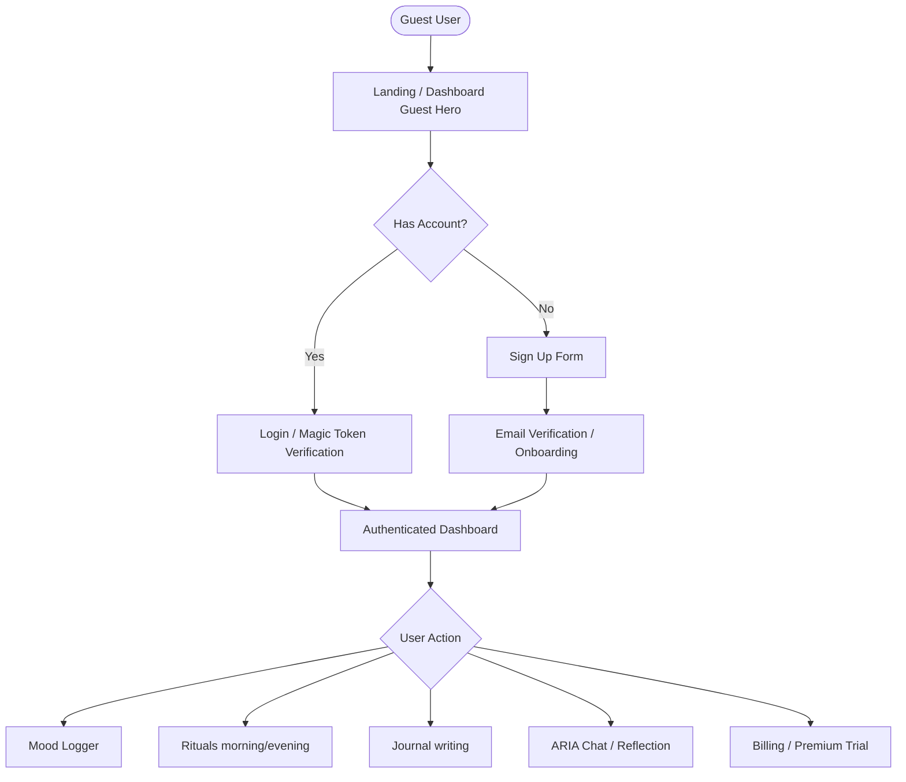
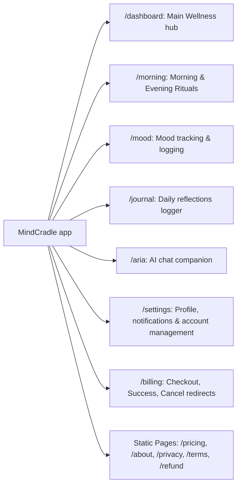
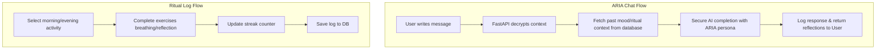
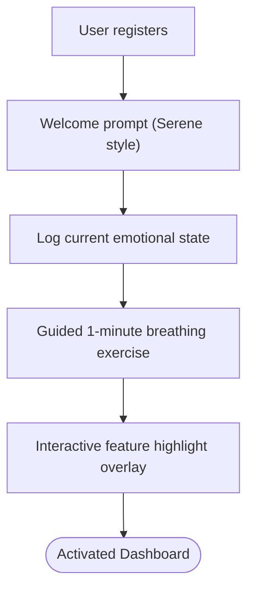
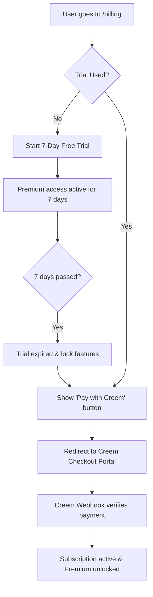
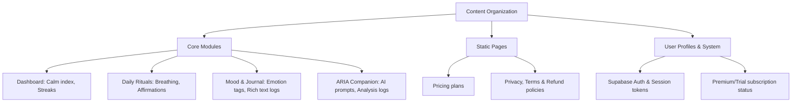
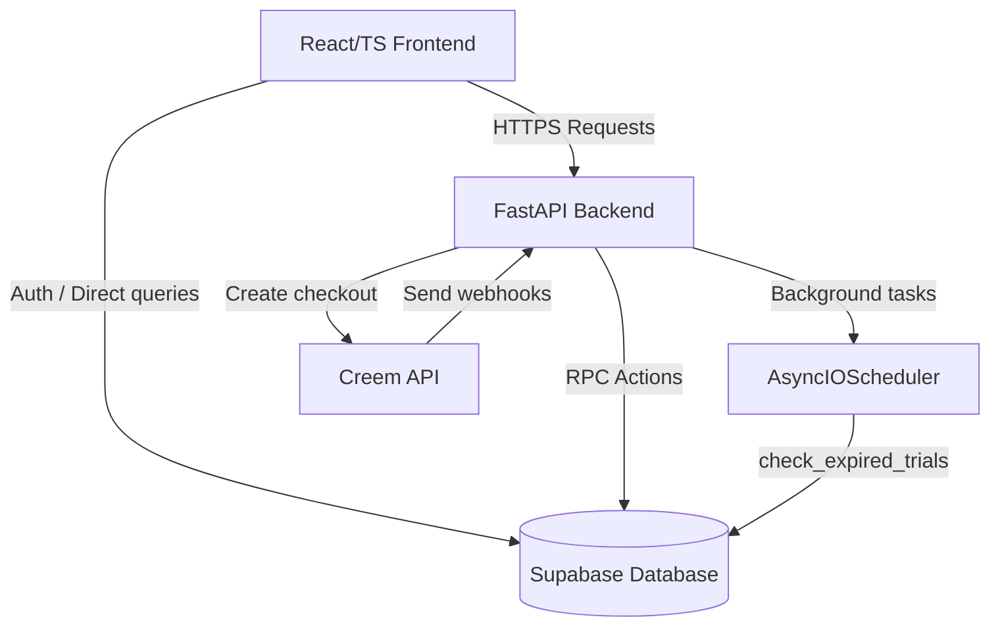
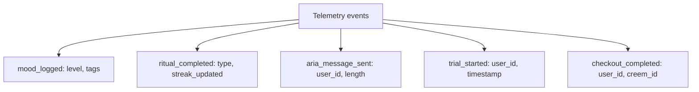

# MindCradle Product Architecture & Flows

This document visualizes how users interact with the MindCradle platform, how pages are structured, and how data flows through the system.

````carousel
### 1. User Flow Diagram
Describes how both guest and authenticated users move through the main paths of the application.


<!-- slide -->
### 2. Site Map
Outlines every page/route in the application and its core purpose.


<!-- slide -->
### 3. Feature Flow
Shows the technical data paths for the main interaction loops in the application.


<!-- slide -->
### 4. Onboarding Flow
First-time user experience when activating an account for the first time.


<!-- slide -->
### 5. Subscription/Checkout Flow
Tracks the journey through free trial activation, expiration, and premium checkout.


<!-- slide -->
### 6. Information Architecture
Structural taxonomy and hierarchy of elements inside MindCradle.


<!-- slide -->
### 7. Database & System Architecture
A high-level view of how frontend, backend services, database schema, and payment APIs connect.


<!-- slide -->
### 8. Analytics & Event Map
Actions and metrics tracked for insight and recovery patterns.


````
